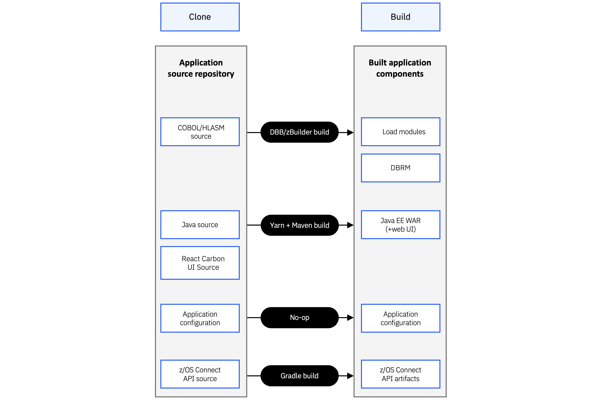

# Build and Deployment Architecture

This page describes how Bank of Z source code is transformed into deployable artifacts and how those artifacts are provisioned across the CICS and IMS runtime environments. IBM DBB, Wazi Deploy, zconfig, and the z/OS Connect CLI automate the build and deployment process when you run the deployment stages.

## Build pipeline

The build process uses IBM Dependency Based Build (DBB) to compile and package all application source into deployable artifacts.

*Figure 1. Relationship between source assets and generated application components.*

Source assets in the repository include:

- COBOL, PL/I, and Assembler application programs
- BMS map definitions
- Db2 source definitions
- Java application source
- z/OS Connect API definitions

The build produces:

- Load modules (COBOL, PL/I, Assembler, and BMS)
- Db2 tables and plans
- Java archive (JAR) files
- z/OS Connect API artifacts
- A Wazi Deploy deployment archive that packages all generated artifacts

## Full and incremental builds

Bank of Z supports both full and incremental build workflows to support different stages of development.

A full build compiles all application components, packages the complete application, and prepares it for deployment. This workflow is typically used during the initial installation or when changes to the runtime infrastructure or environment configuration require a complete redeployment.

An incremental build rebuilds and deploys only the application components affected by source code changes. This workflow is intended for day-to-day development activities, such as implementing enhancements or fixing defects, and avoids rebuilding the entire application or reprovisioning the existing runtime environment.

After the initial deployment, you can perform an incremental build and deploy using the
`pipeline-remote.sh script`. The build process automatically identifies modified source files, rebuilds the impacted components, packages the updated artifacts, and deploys them to the existing runtime environment.

**Note**: An incremental build requires an existing Bank of Z environment that has already been deployed successfully. Use a full build and deployment when setting up a new environment or when infrastructure changes require a complete redeployment.

## CICS deployment

After the build completes, Wazi Deploy installs the generated artifacts into the CICS runtime provisioned by zconfig. The z/OS Connect APIs are configured to route requests to the CICS transaction-processing environment.

*Figure 2. CICS, Db2, and z/OS Connect deployment workflow.*

## IMS deployment

IMS application artifacts are deployed to the IMS region provisioned by zconfig. The z/OS Connect APIs are configured to route requests to the IMS Transaction Manager (TM) environment.

*Figure 3. IMS TM/DB, Db2, and z/OS Connect deployment workflow.*

## Tooling summary

| Tool | Role |
|---|---|
| IBM DBB | Compiles and packages all application source |
| Wazi Deploy | Deploys the build archive to CICS and IMS |
| zconfig | Provisions CICS and IMS runtim environment |
| z/OS Connect CLI | Configures and starts z/OS Connect APIs |

For a description of what each deployment stage does at runtime, see [Deploying Bank of Z](../installation-and-setup/deploying.html).
